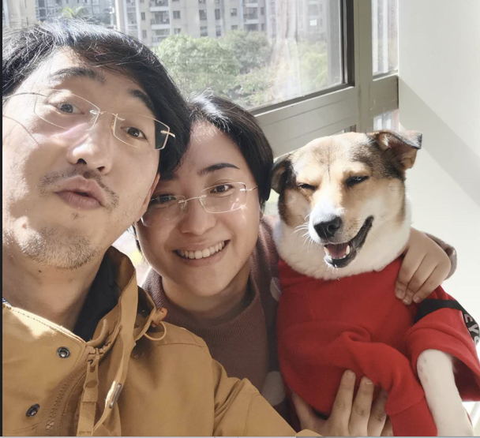
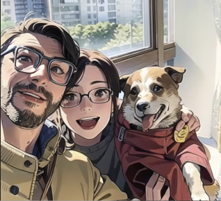

# Blog

Hello and Welcome to my personal Blog.
I set up this blog for course **ELEC4630** and to post some progress about what I will learn about `fastai`.
And I also want to introduce my family in my homepage (●'◡'●). And with AI techniques, the family group photo can be converted into cartoon format. We can see the power of AI in image processing.At least it makes me more handsome.

## Some useful link for *fastai* to start with:
[Practical Deep Learning Course](https://course.fast.ai) 

[Another fastai Practice Course](https://docs.fast.ai)

[Timm fastai Course](https://timm.fast.ai)
